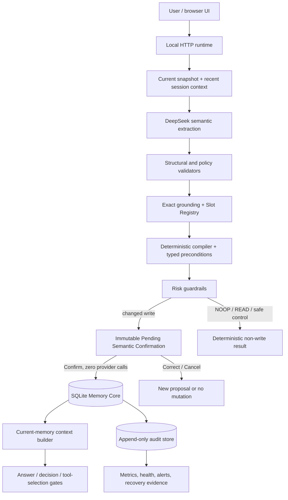

# Architecture

## System overview

Tiger Short/Long Memory is a local, SQLite-backed prototype for `user1` and
`user2`. Its active product mode is `HUMAN_REVIEWED_MEMORY_ASSISTANT`.
Model-derived changes are untrusted proposals: they cannot enter authoritative
Current Memory until the user explicitly confirms the persisted proposal.
Production automatic semantic writes are disabled following the frozen
benchmark safety stop.

The repository contains two related layers:

- `app.py` is the browser-facing prototype runtime. It owns the schema-v6
  `MemoryStore`, HTTP API, provider boundary, typed transitions, proposals,
  revision checks, and deterministic rendering.
- The `memory_*.py` modules are focused validation and operational services.
  They exercise the Phase 1A bi-temporal core, extraction boundary, context,
  decision, action, audit, recovery, security, operations, and release gates.
  They are evidence components, not a second production mutation authority.

## Component diagram



## Trust and authority boundaries

| Boundary | Trusted responsibility | Untrusted or limited input |
|---|---|---|
| User and browser | Explicit Confirm, Correct, or Cancel | Natural-language text and referenced content |
| LLM provider | Candidate semantic interpretation and allowed prose | It cannot authorize or directly perform a memory write |
| Application boundary | Schema checks, exact grounding, registry lookup, typed compilation, ownership, revision, limits, risk routing | It does not repair model semantics with heuristics |
| Pending Proposal | Immutable, rendered candidate bound to user, session, identity, and base revision | It is not Current Memory |
| SQLite | Authoritative Current, History, proposal payload, revision, and committed conversation state | Free-form model wording is never authoritative state |
| Audit store | Append-only reason codes and operational metadata | Raw secrets and sensitive payloads are forbidden |

## Data flow

### Changed-memory turn

1. The runtime reads the user's Current Memory, revision, and recent
   session-scoped conversation without opening a write transaction.
2. At most one normal provider call returns a constrained semantic candidate.
3. The application validates the provider envelope, JSON, schema, user scope,
   exact source grounding, Slot Registry identity, typed limits, and semantic
   operation compatibility.
4. The deterministic compiler derives the typed operation and evaluates it
   against authoritative Current state.
5. `NOOP`, `READ`, `TARGET_NOT_FOUND`, `CLARIFY`, `FREEFORM`, `ABSTAIN`, and
   failed validation remain non-writes.
6. Every valid model-derived changed write is routed to
   `HUMAN_REVIEW_REQUIRED` and persisted as an immutable proposal. Current,
   History, and revision remain unchanged.
7. Confirm performs no provider call. It revalidates user, session, proposal
   identity, status, base revision, Current state, typed preconditions, and
   exact payload identity inside a short transaction.
8. A successful Confirm atomically archives the predecessor when applicable,
   updates Current, increments revision once, consumes the proposal, and stores
   the application-owned acknowledgement. Any failure rolls back the whole
   transaction.

### Read and context flow

Only active Current facts are exposed to context builders. Historical rows,
pending proposals, audit metadata, timestamps, and internal IDs are excluded
unless a specific validated diagnostic or history-read path requests them.
Decision and answer services may use relevant Current context but must not
invent missing memory or allow memory text to override higher-priority rules.

## Memory lifecycle

```text
Absent
  -> validated candidate
  -> PENDING_REVIEW
      -> CONFIRMED -> Current
      -> REJECTED  -> no Current mutation
      -> CANCELLED -> no Current mutation
      -> EXPIRED   -> no Current mutation

Current v1
  -> confirmed replacement/correction
  -> History(v1) + Current(v2) + revision increment

Current lineage
  -> confirmed whole-memory forget
  -> Current and linked History removed for that lineage only
```

Terminal proposal states cannot be reused. Stale or cross-scope confirmation
fails closed. Same-value reassertion is a deterministic `NOOP` and creates no
proposal, History row, or revision increment.

## Persistence and identity

- Stable `memory_id` is the authoritative lineage identity.
- `slot_id` is the versioned semantic property definition.
- `entity_id` identifies an application-owned real-world instance.
- `semantic_key` is compatibility metadata and, for registry-managed rows,
  equals the canonical `slot_id`.
- Current and History use the same lineage identity across replacements.
- The schema version is 6. Legacy rows remain readable; there is no guessed
  backfill or free-text identity reconstruction.

## Security boundaries

- The service binds to localhost.
- Only `user1` and `user2` are admitted.
- User and session scope are rechecked in SQLite operations, not merely in UI
  controls.
- Sensitive attributes, prompt injection, malformed output, ambiguous targets,
  invalid grounding, stale revisions, and database errors fail closed.
- No SQLite write transaction is held while waiting for DeepSeek.
- Provider failures leave conversation, Current, History, revision, and
  proposals unchanged for the attempted turn.
- Production auto-commit is hard-disabled for the current model/architecture.

## Deliberate non-goals

The project does not include a vector database, embeddings, RAG, summary or
procedural memory, LangGraph, a multi-agent runtime, or self-learning. The
decision and tool modules are bounded validation gates rather than an
autonomous agent.

